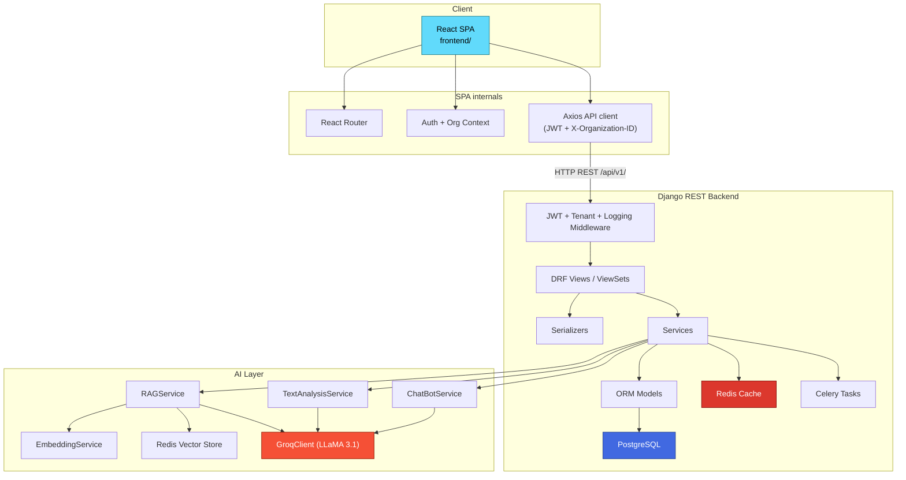
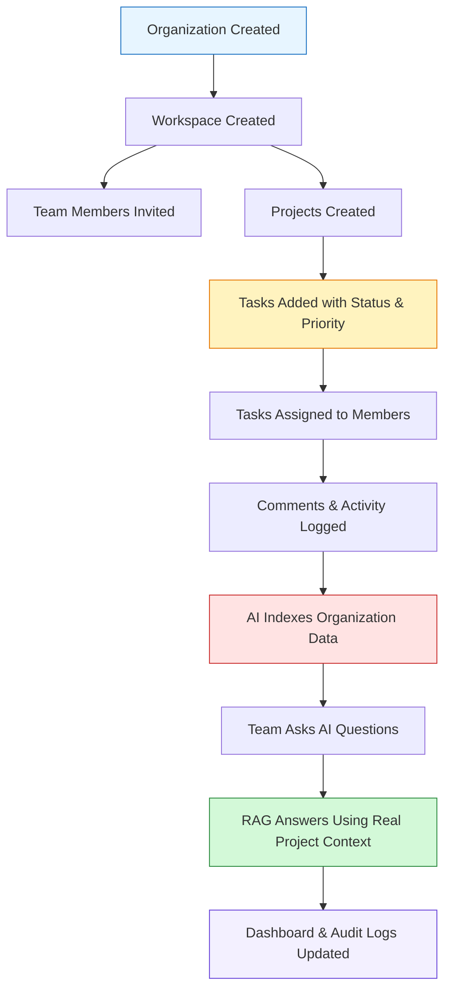
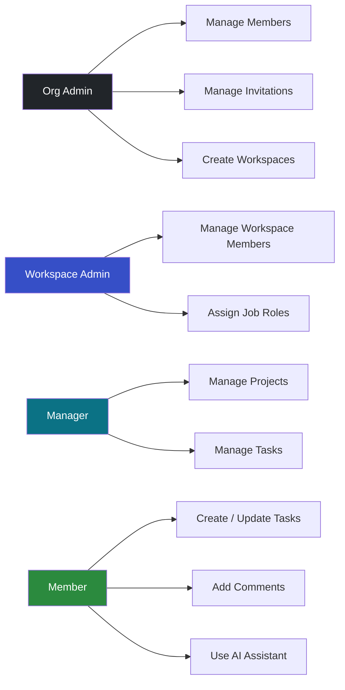
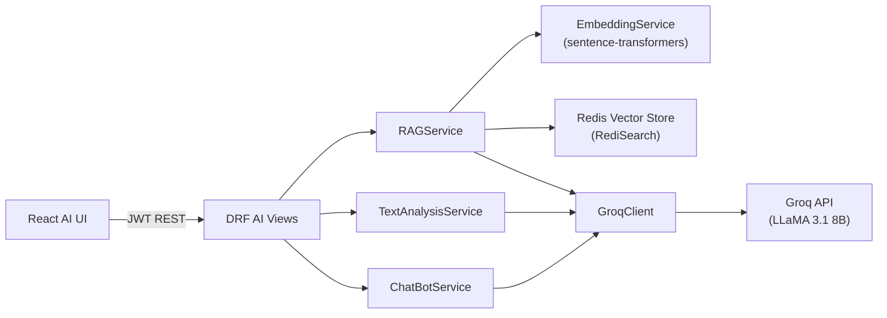
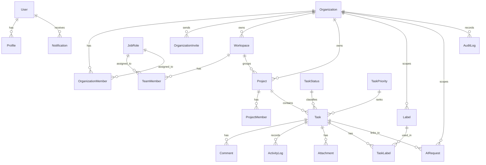
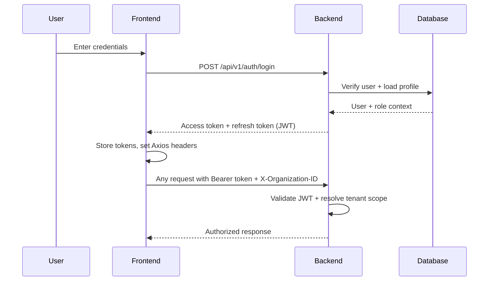

# CollabAI — Project Management Platform


A full-stack AI-powered project management platform for organizing teams, projects, tasks, and collaboration — with a built-in AI assistant powered by RAG (Retrieval-Augmented Generation) and semantic search.

The project is split into a clean client-server architecture:

```txt
backend/   → Django REST Framework API
frontend/  → React 19 SPA (Create React App)
```

---

## What This Project Does

CollabAI digitalizes team collaboration and project tracking with an integrated AI layer that understands your organization's data.

The platform connects the full lifecycle of team work:

```txt
Organization setup → Workspaces → Projects → Tasks → Comments & Activity → AI-powered insights
```

It is designed for multi-tenant operation, where one platform can serve multiple organizations while keeping all of their data strictly isolated.

---

## Main Features

| Area | Description |
|---|---|
| Authentication | JWT-based login, registration, token refresh, token blacklisting, and password reset via email |
| Organizations | Multi-tenant root entities; each organization isolates its own data |
| Invitations | Email-based invitations with scoped roles and token-based acceptance |
| Workspaces | Sub-groups within an organization for separating teams or departments |
| Job Roles | Discipline-based roles (Backend, Frontend, DevOps, etc.) used for task assignment and AI context |
| Projects | Time-bounded projects linked to organizations and optionally to workspaces |
| Tasks | Full task lifecycle — status, priority, labels, assignee, due date, and file attachments |
| Comments | Task-level comments with activity log tracking |
| Notifications | In-app notification feed scoped per user and organization |
| AI Chatbot | General-purpose LLM chatbot accessible from any page via a floating panel |
| AI Text Analysis | Summarize text, extract action items, and detect sentiment using LLM |
| AI Semantic Search | Vector-based search across your organization's tasks and comments |
| RAG Q&A | Ask natural-language questions; the AI answers using your actual project data as context |
| Audit Logs | Admin-level audit trail of important actions across the platform |
| Dashboard | Summary view of tasks, projects, and team activity |

---

## System Architecture



---

## Core Workflow



---

## Roles & Access

| Role | Scope | Main Responsibility |
|---|---|---|
| Org Admin | Organization | Full control over org setup, members, workspaces, invitations |
| Workspace Admin | Workspace | Manage workspace members and job roles |
| Manager | Workspace | Day-to-day project and task management |
| Member | Workspace / Project | Create tasks, comment, use AI assistant |



---

## AI Module

CollabAI includes a full AI layer powered by **Groq (LLaMA 3.1)** for LLM inference and **sentence-transformers** for embeddings.



### AI Capabilities

| Feature | Endpoint | Description |
|---|---|---|
| Chatbot | `POST /api/v1/ai/chatbot/` | General-purpose LLM chat |
| Text Analysis | `POST /api/v1/ai/analyze/` | Summary, action items, or sentiment |
| Semantic Search | `POST /api/v1/ai/search/` | Vector search across org data |
| RAG Q&A | `POST /api/v1/ai/query/` | Answer questions using your project context |
| Reindex | `POST /api/v1/ai/reindex/` | Queue a Celery reindex job |
| History | `GET /api/v1/ai/history/` | View past AI request records |

Text analysis supports three modes:

```json
{ "text": "Sprint retro notes...", "mode": "summary" }
{ "text": "Sprint retro notes...", "mode": "action_items" }
{ "text": "Sprint retro notes...", "mode": "sentiment" }
```

RAG query example:

```json
{
  "organization_id": 1,
  "question": "Which tasks are currently blocked?",
  "top_k": 5
}
```

---

## Backend Structure

```txt
backend/
├── config/
│   ├── settings.py          # Django settings
│   ├── urls.py              # Root URL config (/admin, /api/v1/, Swagger)
│   ├── api_v1_urls.py       # Versioned API route includes
│   ├── celery.py            # Celery app configuration
│   └── middleware.py        # Logging, JWT, and tenant middleware
├── apps/
│   ├── core/                # Auth, dashboard, health check, metrics, password reset
│   ├── organizations/       # Org models, members, invitations
│   ├── workspaces/          # Workspaces, team members, job roles
│   ├── projects/            # Projects, project members, integrations, subscriptions
│   ├── tasks/               # Tasks, statuses, priorities, labels, attachments
│   ├── comments/            # Comments and activity logs
│   ├── notifications/       # User notification feed
│   ├── ai_assistant/        # LLM chatbot, text analysis, RAG, vector store
│   ├── audit_logs/          # Audit trail
│   └── user_profiles/       # User profiles, password reset tokens
└── common/                  # BaseModel, permissions, tenant helpers, cache, pagination
```

Each app follows the same internal structure:

```txt
models.py      → ORM entities extending BaseModel
serializers/   → Validation and API representation
views/         → DRF endpoints (APIView, generics, ViewSets)
services/      → Business logic and domain rules
filters.py     → django-filter FilterSets
signals.py     → Side effects: notifications, audit logs, AI indexing
tasks.py       → Celery background jobs
```

---

## Frontend Structure

```txt
frontend/
├── src/
│   ├── api/               # Axios API client + endpoint functions per domain
│   ├── components/        # Reusable UI components (KanbanBoard, Sidebar, AI panels)
│   ├── context/           # AuthContext, organization context
│   ├── hooks/             # Custom React hooks
│   ├── pages/             # Full page views
│   │   ├── Dashboard.js
│   │   ├── Projects.js
│   │   ├── Tasks.js
│   │   ├── AIAssistant.js
│   │   ├── Organizations.js
│   │   ├── WorkspaceDetail.js
│   │   ├── NotificationsPage.jsx
│   │   └── ProfilePage.js
│   ├── routes/            # Route definitions
│   ├── services/          # Client-side service helpers
│   ├── utils/             # Shared utilities
│   └── validation/        # Form validation schemas
├── package.json
└── public/
```

Frontend stack: **React 19**, **React Router v7**, **Axios**, **React Hook Form**, **Recharts**

---

## Data Model Overview



---

## Authentication Flow



Self-contained JWT authentication — no third-party auth service required.  
Token refresh and blacklist are handled by `djangorestframework-simplejwt`.

---

## API Reference

All endpoints are under `/api/v1/`. Swagger UI is available at `/api/docs/`.

```http
Authorization: Bearer <access-token>
X-Organization-ID: <organization-id>
```

### Endpoint Groups

```txt
/api/v1/auth/              → Login, register, refresh, logout, password reset
/api/v1/organizations/     → CRUD + members + invitations
/api/v1/workspaces/        → CRUD + team members + job roles
/api/v1/projects/          → CRUD + project members
/api/v1/tasks/             → CRUD + labels + attachments
/api/v1/comments/          → Task comments + activity log
/api/v1/notifications/     → User notification feed
/api/v1/ai/                → Chatbot, text analysis, semantic search, RAG, history
/api/v1/audit-logs/        → Audit trail
/api/v1/dashboard/summary/ → Tenant-scoped stats
/api/v1/health/            → Service health check (DB, cache, vector store, LLM)
/api/v1/metrics/           → Admin-only platform metrics
```

Typical REST operations:

```http
GET    /api/v1/projects/
POST   /api/v1/projects/
GET    /api/v1/projects/{id}/
PATCH  /api/v1/projects/{id}/
DELETE /api/v1/projects/{id}/
```

> Important: the frontend sends organization IDs and entity IDs, but the backend always re-validates tenant scope and RBAC before serving any response.

---

## Screenshots

> Add screenshots of your running frontend here. Suggested views to capture:

| View | What to show |
|---|---|
| **Dashboard** | Summary stats, project overview cards |
| **Kanban Board** | Task board with status columns |
| **AI Assistant** | Floating chat panel or the full AI Assistant page |
| **Task Detail** | Task with comments, labels, attachments, activity log |
| **Organization Settings** | Members list, invite panel |
| **Workspace View** | Team members with job roles |

```
<!-- Example: -->


```

---

## Tech Stack Summary

| Layer | Technology |
|---|---|
| Backend language | Python 3.12+ |
| Backend framework | Django 6 + Django REST Framework |
| Auth | `djangorestframework-simplejwt` (JWT) |
| API docs | `drf-spectacular` (Swagger / OpenAPI) |
| ORM | Django ORM + PostgreSQL |
| Cache + Vector store | Redis Stack (RediSearch) |
| Async tasks | Celery + Redis broker |
| AI / LLM | Groq API (LLaMA 3.1 8B Instant) |
| Embeddings | `sentence-transformers` (all-MiniLM-L6-v2) |
| RAG vector search | `redisvl` |
| Frontend | React 19 + React Router v7 |
| HTTP client | Axios |
| Forms | React Hook Form |
| Charts | Recharts |
| Containerization | Docker Compose |

---

## Installation

### Prerequisites

- Python 3.12+
- Node.js 20+
- PostgreSQL 15+
- Redis Stack (not plain Redis — required for RediSearch vector indexing)
- Git
- A free [Groq API key](https://console.groq.com) for AI features

---

## Run with Docker Compose

The easiest way to run the full stack:

```bash
git clone <repo-url>
cd collabai-project-management
cp backend/.env.example backend/.env
# Edit backend/.env and set SECRET_KEY and GROQ_API_KEY
docker compose up --build
```

Services started:

| Service | Port |
|---|---|
| Frontend (React) | `http://localhost:3000` |
| Backend (Django) | `http://localhost:8000` |
| PostgreSQL | `5432` |
| Redis Stack | `6379` |

---

## Run Manually

### Backend

```bash
cd backend
python -m venv .venv
source .venv/bin/activate        # Windows: .venv\Scripts\activate
pip install -r requirements.txt
cp .env.example .env
# Edit .env — set SECRET_KEY, DB credentials, REDIS_URL, GROQ_API_KEY
python manage.py migrate
python manage.py runserver
```

Swagger UI: `http://127.0.0.1:8000/api/docs/`

### Frontend

```bash
cd frontend
npm install
cp .env.example .env
# Set REACT_APP_API_URL=http://127.0.0.1:8000/api/v1
npm start
```

Frontend runs on: `http://localhost:3000`

---

## Environment Variables

### Backend (`backend/.env`)

```txt
SECRET_KEY=                          # Django secret key (required)
DEBUG=True                           # Set False in production
ALLOWED_HOSTS=localhost,127.0.0.1

DB_HOST=localhost
DB_PORT=5432
DB_NAME=collabai_db
DB_USER=postgres
DB_PASSWORD=

REDIS_URL=redis://127.0.0.1:6379/0
CELERY_BROKER_URL=redis://127.0.0.1:6379/1

GROQ_API_KEY=                        # From console.groq.com
GROQ_MODEL=llama-3.1-8b-instant

RAG_EMBEDDING_MODEL=sentence-transformers/all-MiniLM-L6-v2
RAG_AUTO_INDEX=true

JWT_ACCESS_TOKEN_LIFETIME_MINUTES=60
JWT_REFRESH_TOKEN_LIFETIME_DAYS=7

FRONTEND_URL=http://localhost:3000
```

### Frontend (`frontend/.env`)

```txt
REACT_APP_API_URL=http://127.0.0.1:8000/api/v1
```

> Never commit `.env` files to version control.

---

## Optional: Celery Worker

For real async AI indexing and background jobs (when `CELERY_TASK_ALWAYS_EAGER=false`):

```bash
cd backend
celery -A config worker -l info
```

Optional beat scheduler:

```bash
celery -A config beat -l info
```

---

## Database Migrations

```bash
cd backend
python manage.py migrate
```

If a new migration is needed:

```bash
python manage.py makemigrations
python manage.py migrate
```

---

## Health Checks

Verify services are running after startup:

```bash
# Check Django config
python manage.py check

# Check Groq LLM connection
python manage.py check_groq

# Check Redis connection
python manage.py check_redis
```

Or hit the API health endpoint:

```http
GET /api/v1/health/
```

---

## Running Tests

### Backend

```bash
cd backend
python manage.py test
```

### Frontend (unit)

```bash
cd frontend
npm test -- --watchAll=false
```

### Frontend E2E (Cypress)

```bash
cd frontend
npm run e2e:ci
```

---

## CI/CD

GitHub Actions workflows in `.github/workflows/`:

| Workflow | Trigger | What it does |
|---|---|---|
| `tests.yml` | Push / PR | Runs Django backend tests |
| `lint.yml` | Push / PR | Lints frontend JS/JSX |
| `frontend-e2e.yml` | Push / PR | Runs Cypress E2E tests |
| `build.yml` | Push / PR | Builds the Docker images |

---

## Project Documentation

Additional technical documentation is in the `docs/` folder:

| File | Contents |
|---|---|
| `architecture.md` | High-level system architecture |
| `backend_architecture.md` | Backend layer responsibilities and OOP patterns |
| `api-endpoints.md` | Full endpoint reference |
| `database-models.md` | All 24 models with field descriptions |
| `ai-module.md` | AI/LLM/RAG module deep-dive |
| `caching.md` | Redis caching strategy |
| `security.md` | JWT, CORS, CSRF, and production hardening |
| `setup.md` | Local development setup guide |
| `requirements-checklist.md` | Course requirements tracking |
