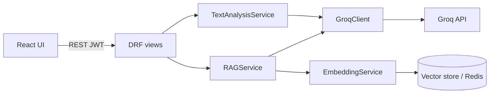

# AI / LLM module (`apps.ai_assistant`)

CollabAI integrates an external **LLM API (Groq)** for chatbot-style Q&A and text analysis. AI features are exposed under **`/api/v1/ai/`** and documented in Swagger (`/api/docs/`).

## Architecture



## Configuration

| Setting | Env variable |
|---------|----------------|
| API key | `GROQ_API_KEY` |
| Model | `GROQ_MODEL` |
| Embeddings | `RAG_EMBEDDING_MODEL` |

See [setup.md](./setup.md) and `backend/.env.example`.

## Endpoints (summary)

| Method | Path | Purpose |
|--------|------|---------|
| `POST` | `/ai/query/` | RAG chatbot (question + workspace context) |
| `POST` | `/ai/analyze/` | Text analysis (summary, action items, sentiment) |
| `POST` | `/ai/search/` | Semantic search (no LLM) |
| `POST` | `/ai/reindex/` | Queue workspace reindex (Celery) |
| `GET` | `/ai/history/` | Recent `AIRequest` records for current user |

Full request/response notes: [api-endpoints.md](./api-endpoints.md#ai--llm-module).

## Text analysis modes

`POST /api/v1/ai/analyze/` body:

```json
{
  "text": "Sprint retro: deployment delayed, team morale is low but we fixed two critical bugs.",
  "mode": "summary"
}
```

`mode` values:

- `summary` — concise summary
- `action_items` — markdown checklist
- `sentiment` — JSON tone classification

## Frontend

On **AI Assistant** (`/ai`), use the **Analyze text** tab to call `POST /api/v1/ai/analyze/` (summary, action items, sentiment).

## Tests

```bash
cd backend
python manage.py test apps.ai_assistant
```
