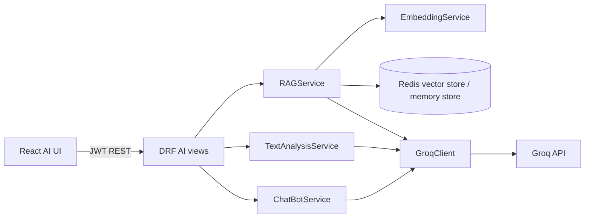

# AI / LLM Module (`apps.ai_assistant`)

CollabAI integrates an external LLM provider for chatbot responses, text analysis, semantic search, and RAG question answering. The current provider is Groq through `apps.ai_assistant.services.groq_client.GroqClient`.

Important course note: requirement #16 mentions OpenAI specifically. The behavior is implemented, but the provider is Groq. If the final grading requires OpenAI API by name, add an OpenAI provider or replace the Groq client.

## Architecture



## Configuration

| Setting | Environment variable | Purpose |
|---------|----------------------|---------|
| API key | `GROQ_API_KEY` | External LLM API key. |
| Model | `GROQ_MODEL` | Chat/completion model name. |
| Embedding model | `RAG_EMBEDDING_MODEL` | Sentence-transformer model for embeddings. |
| Embedding dimensions | `RAG_EMBEDDING_DIMS` | Vector dimension count. |
| Vector index | `RAG_VECTOR_INDEX_NAME` | Redis vector index name. |
| Default top K | `RAG_TOP_K_DEFAULT` | Default number of retrieved context items. |
| Auto-index | `RAG_AUTO_INDEX` | Whether model changes auto-index for RAG. |

See [setup.md](./setup.md) and `backend/.env.example`.

## Endpoints

All endpoints require JWT authentication.

| Method | Full path | Purpose |
|--------|-----------|---------|
| `POST` | `/api/v1/ai/chatbot/` | General chatbot reply without RAG context. |
| `POST` | `/api/v1/ai/analyze/` | Text analysis: summary, action items, sentiment. |
| `POST` | `/api/v1/ai/search/` | Semantic search without LLM answer generation. |
| `POST` | `/api/v1/ai/query/` | RAG answer using organization context and sources. |
| `POST` | `/api/v1/ai/reindex/` | Queue organization reindex job through Celery. |
| `GET` | `/api/v1/ai/history/` | Recent `AIRequest` records for the current user. |

## Text analysis

`POST /api/v1/ai/analyze/`

```json
{
  "text": "Sprint retro: deployment delayed, team morale is low but we fixed two critical bugs.",
  "mode": "summary",
  "task_id": null
}
```

Supported modes:

- `summary`
- `action_items`
- `sentiment`

## RAG query

`POST /api/v1/ai/query/`

```json
{
  "organization_id": 1,
  "question": "Which tasks are blocked?",
  "top_k": 5,
  "task_id": null
}
```

The response includes an answer, sources, and an `AIRequest` record id.

## Background jobs

`POST /api/v1/ai/reindex/` queues `apps.ai_assistant.tasks.reindex_organization`. Celery is configured in `backend/config/celery.py`.

## Frontend

The AI UI is implemented in:

- `frontend/src/pages/AIAssistant.js`
- `frontend/src/components/AIAssistantChat.js`
- `frontend/src/components/ChatBotPanel.js`
- `frontend/src/api/ai.js`
- `frontend/src/api/chatbot.js`

## Tests

```bash
cd backend
python manage.py test apps.ai_assistant
```
