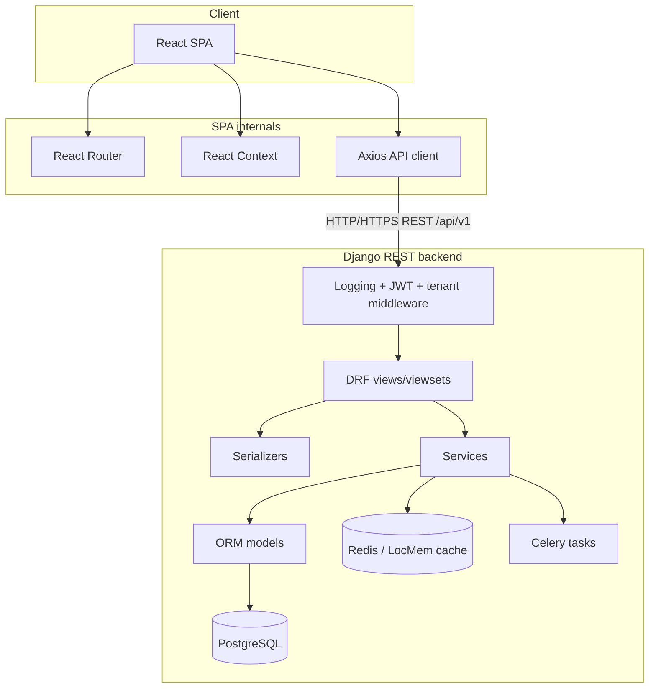

# CollabAI Architecture Overview

This document connects the main CollabAI layers and points contributors to the detailed technical references.

## Detailed docs

| Layer | Document |
|-------|----------|
| Backend architecture | [backend_architecture.md](./backend_architecture.md) |
| API endpoints | [api-endpoints.md](./api-endpoints.md) |
| Database models | [database-models.md](./database-models.md) |
| Local setup | [setup.md](./setup.md) |
| Security | [security.md](./security.md) |
| AI / LLM module | [ai-module.md](./ai-module.md) |
| Caching / Redis | [caching.md](./caching.md) |
| Course checklist | [requirements-checklist.md](./requirements-checklist.md) |

## High-level view

## Runtime responsibilities

| Layer | Responsibility |
|-------|----------------|
| React frontend | Routes, forms, dashboards, AI UI, auth state, organization context. |
| Axios API client | Adds JWT token and `X-Organization-ID`, refreshes expired tokens, normalizes API errors. |
| Django middleware | Request logging, JWT enforcement, CORS, and active-tenant selection. |
| DRF views/viewsets | HTTP orchestration, permissions, status codes, serializers, and service calls. |
| Services/tasks | Business logic, AI calls, RAG indexing, email/reset jobs, and async work. |
| ORM models | Persistent domain state and relationships. |
| Redis | API response caching, Celery broker/backend, and optional RAG vector store. |
| PostgreSQL | Primary relational database. |

## Development rules

1. Product API endpoints live under `/api/v1/`.
2. Swagger UI is available at `/api/docs/`; OpenAPI schema is available at `/api/schema/`.
3. Frontend HTTP calls should go through `frontend/src/api/`.
4. Shared backend behavior belongs in `backend/common/`.
5. New model changes require migrations.
6. New or changed endpoints should be covered by tests and visible in Swagger.

## Done checklist per feature

- Code matches the patterns in this document and `backend_architecture.md`.
- Backend tests pass when backend behavior changes.
- Frontend tests pass when UI behavior changes.
- New endpoints appear in Swagger.
- `backend/.env.example` or `frontend/.env.example` is updated when new environment variables are introduced.
- Docs are updated when routes, models, architecture, or setup steps change.
