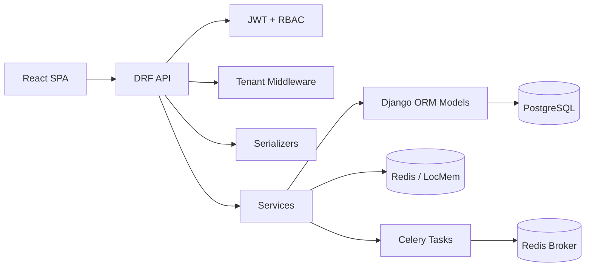

# CollabAI Backend Architecture

## 1. Directory layout (`backend/`)

```text
backend/
|-- manage.py
|-- requirements.txt
|-- schema.yml
|-- config/
|   |-- settings.py
|   |-- urls.py              # /admin, /api/v1/, schema, Swagger UI
|   |-- api_v1_urls.py       # Versioned includes for domain apps
|   |-- middleware.py
|   |-- celery.py
|   |-- asgi.py / wsgi.py
|-- apps/
|   |-- core/           # Auth, dashboard, health, metrics, password reset
|   |-- organizations/  # Tenant roots, members, invitations
|   |-- workspaces/     # Workspaces, workspace members, job roles
|   |-- projects/
|   |-- tasks/
|   |-- comments/
|   |-- notifications/
|   |-- ai_assistant/   # LLM/RAG integration, chatbot, text analysis
|   |-- audit_logs/
|   |-- user_profiles/
|-- common/             # BaseModel, permissions, tenant helpers, cache, pagination
```

Each domain app (`apps.<name>`) keeps code grouped by responsibility:

| Folder / module | Responsibility |
|-----------------|----------------|
| `models.py`, `models/` | ORM models extending `common.models.BaseModel`. |
| `serializers/` | Validation and API representation. |
| `views/` | DRF endpoints using `APIView`, `generics.*`, or `ModelViewSet`. |
| `services/` | Business logic and cohesive domain operations. |
| `filters.py` | `django-filter` FilterSets for API filtering. |
| `signals.py` | Side effects such as activity logging, notifications, indexing, and cache invalidation. |
| `tasks.py` | Celery background jobs. |

## 2. OOP principles

| Principle | How it applies |
|-----------|----------------|
| Inheritance | Models extend `BaseModel`; permissions subclass `BasePermission`; views subclass DRF view classes. |
| Abstraction | Shared serializers, services, permissions, cache helpers, pagination, and tenant helpers define common contracts. |
| Encapsulation | User creation, authentication token issuing, AI calls, RAG indexing, and other domain rules live in services/tasks. |
| Polymorphism | DRF viewsets, serializers, permissions, and vector-store providers override framework/base-class behavior. |

## 3. DRF guidelines

- Serializers validate and represent data.
- Views orchestrate HTTP behavior: permissions, status codes, serializers, services.
- Services contain side effects and domain rules.
- Product API routes are versioned under `/api/v1/`.
- Swagger/OpenAPI docs are generated with `drf-spectacular`.

## 4. Naming conventions

| Artifact | Convention | Example |
|----------|------------|---------|
| Model | PascalCase | `Project`, `Task`, `OrganizationMember` |
| Serializer | `ModelNameSerializer` or use-case name | `ProjectSerializer`, `LoginSerializer` |
| View class | Purpose + `View` / `APIView` / `ViewSet` | `RegisterView`, `TaskViewSet` |
| Service | Purpose + `Service` | `RegisterService`, `RAGService` |
| URL path | Kebab-case or resource names under `/api/v1/` | `/api/v1/auth/register` |

## 5. Authentication and authorization

CollabAI uses JWT authentication for product API routes and Django session authentication for the admin site.

| Area | Implementation |
|------|----------------|
| Register | `POST /api/v1/auth/register` in `apps.core.views.RegisterView` |
| Login | `POST /api/v1/auth/login` in `apps.core.views.LoginView` |
| Refresh | `POST /api/v1/auth/refresh` |
| Logout | `POST /api/v1/auth/logout`, with refresh-token blacklisting |
| JWT parsing | DRF SimpleJWT plus `config.middleware.JWTAuthenticationMiddleware` |
| Public API paths | `API_JWT_PUBLIC_PATHS` in `backend/config/settings.py` |

RBAC is implemented through membership rows rather than separate Role/Permission tables:

| Scope | Model | Roles |
|-------|-------|-------|
| Organization | `OrganizationMember` | `org_admin`, `member` |
| Workspace | `TeamMember` | `workspace_admin`, `manager`, `member` |
| Invitation | `OrganizationInvite` | `org_admin`, `workspace_admin`, `manager`, `member` |

Permission logic lives in `common.role_permissions` and `common.permissions`.

## 6. Multi-tenancy

The tenant boundary is the organization.

| Component | Location | Purpose |
|-----------|----------|---------|
| `Organization` | `apps.organizations.models` | Tenant/company root |
| `TenantMiddleware` | `apps.core.middleware` | Attaches active organization context to authenticated requests |
| Tenant header | `X-Organization-ID` | Lets the frontend select the active organization |
| Tenant helpers | `common.tenant_access` | Resolves accessible organizations and active tenant IDs |
| Tenant query tools | `common.tenant_queryset`, `common.tenant_viewset` | Reusable organization-scoped query behavior |

## 7. Middleware

| Middleware | Location | Purpose |
|------------|----------|---------|
| `RequestLoggingMiddleware` | `config/middleware.py` | Adds `X-Request-ID` and logs method, path, status, duration, user, and IP. |
| `JWTAuthenticationMiddleware` | `config/middleware.py` | Enforces Bearer JWT on `/api/v1/` except configured public paths. |
| `CorsMiddleware` | `django-cors-headers` | Allows the React SPA to call the API. |
| `TenantMiddleware` | `apps/core/middleware.py` | Selects the active organization/tenant for the request. |

## 8. Caching and background jobs

| Concern | Implementation |
|---------|----------------|
| Cache backend | Redis via `django-redis` when `REDIS_URL` is set; LocMem fallback for development/tests. |
| Cache helpers | `common.cache.CachedListMixin`, `CachedGETMixin`, versioned keys. |
| Cache invalidation | `common.cache_signals` and app `signals.py` files. |
| Background jobs | Celery in `config/celery.py`. |
| AI reindex jobs | `apps.ai_assistant.tasks.reindex_organization`. |
| Email/reset jobs | `apps.core.tasks`. |

## 9. Component diagram



## 10. Code organization habits

1. Keep business rules in services or model/query helper modules, not directly in serializers when the logic is reusable.
2. Prefer shared helpers from `common.*`.
3. Document public endpoints with `@extend_schema` or rely on DRF viewset metadata where appropriate.
4. Keep app API modules under each domain app.
5. Keep tests near the owning app in `tests.py` or focused `tests_*.py` modules.

Use `common.pagination.StandardPagination` as the global default. Override pagination only when an endpoint intentionally returns a small fixed payload.
