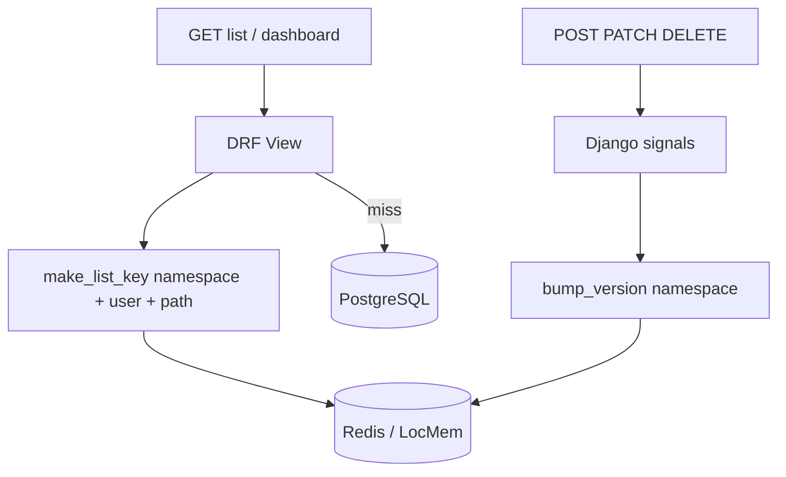

# Caching (Redis) — requirement #17

CollabAI caches frequently read API responses to reduce database load. When `REDIS_URL` is set, Django uses **Redis** via `django-redis`; otherwise **LocMem** is used for local development and tests.

## Configuration

| Variable | Default | Purpose |
|----------|---------|---------|
| `REDIS_URL` | — | e.g. `redis://127.0.0.1:6379/0` |
| `CACHE_DEFAULT_TIMEOUT` | `300` | TTL (seconds) for list/dashboard cache entries |
| `METRICS_CACHE_TIMEOUT` | `60` | TTL for admin metrics snapshot |

See `backend/config/settings.py` and `backend/.env.example`.

## Architecture



**Versioned keys:** each namespace (`projects`, `tasks`, `workspaces`, etc.) has a version counter. On data changes, `bump_version` invalidates all list keys for that namespace without scanning Redis.

## Cached endpoints

| Endpoint | Namespace | Invalidated when |
|----------|-----------|------------------|
| `GET /api/v1/projects/` | `projects` | Project CRUD |
| `GET /api/v1/tasks/` | `tasks` | Task CRUD |
| `GET /api/v1/workspaces/` | `workspaces` | Workspace, member, invite changes |
| `GET /api/v1/organizations/` | `organizations` | Organization CRUD |
| `GET /api/v1/dashboard/summary/` | `dashboard` | Tasks, projects, workspaces, orgs |
| `GET /api/v1/metrics/` | `metrics` | Any of the above (admin only) |
| `GET /api/v1/comments/` | `comments` | Comment CRUD |
| `GET /api/v1/notifications/` | `notifications` | Notification CRUD / mark read |
| `GET /api/v1/activity-logs/` | `activity_logs` | Activity log writes |

## Code layout

| File | Role |
|------|------|
| `backend/common/cache.py` | Key helpers, `CachedListMixin`, `CachedGETMixin` |
| `backend/common/cache_signals.py` | Cross-namespace invalidation |
| `backend/apps/*/signals.py` | Model hooks → bump versions |

## Health check

`GET /api/v1/health/` returns `"cache": "redis"` or `"locmem"` when the cache backend responds to a ping.

## Verify Redis before demo

```bash
cd backend
# Set REDIS_URL=redis://127.0.0.1:6379/0 in .env first
python manage.py check_redis
```

If `REDIS_URL` is missing, Django logs a warning on startup and uses LocMem (fine for unit tests, not for course demo).

## Tests

```bash
cd backend
python manage.py test apps.core.tests_cache apps.workspaces.tests_cache apps.projects.tests apps.tasks.tests
```
