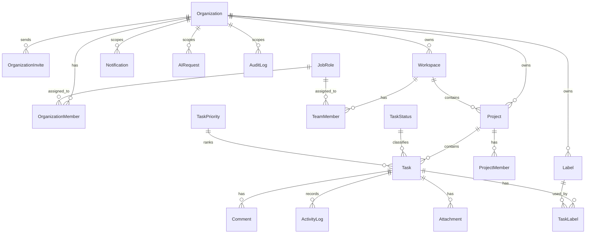

# CollabAI Database Models

This document describes the current database model layer used by CollabAI. The backend uses Django ORM models, PostgreSQL for normal runtime, and migrations in each app.

## Design Principles

| Principle | Implementation |
|-----------|----------------|
| OOP | Domain entities are Python classes that inherit from `common.models.BaseModel`. |
| ORM | All persistence goes through Django ORM models and querysets. |
| Multi-tenancy | Most product data is scoped through `Organization`; workspaces sit inside organizations. |
| RBAC | Roles are stored on `OrganizationMember` and `TeamMember`, not in separate Role/Permission tables. |
| Data integrity | Foreign keys, unique constraints, and indexes protect relationships and common lookups. |

## Shared Base Model

`common.models.BaseModel` is an abstract model used by project-owned models.

Fields:

- `created_at`
- `updated_at`

## Current Project Models

The project currently has 24 app-level models.

| App | Model | Purpose |
|-----|-------|---------|
| `organizations` | `Organization` | Tenant/company root. |
| `organizations` | `OrganizationMember` | User membership in an organization, including organization-level role. |
| `organizations` | `OrganizationInvite` | Email invitation into an organization, optionally tied to a workspace. |
| `workspaces` | `Workspace` | Working area inside an organization. |
| `workspaces` | `JobRole` | Functional discipline used for task assignment and AI task categorization. |
| `workspaces` | `TeamMember` | User membership and role inside a workspace. |
| `projects` | `Project` | Project owned by an organization and optionally linked to a workspace. |
| `projects` | `ProjectMember` | Explicit user access to a project. |
| `projects` | `Subscription` | One-to-one subscription/plan data for an organization. |
| `projects` | `Integration` | External integration configuration scoped to an organization. |
| `tasks` | `TaskStatus` | Task status catalog, such as To Do, In Progress, Done. |
| `tasks` | `TaskPriority` | Task priority catalog with numeric level. |
| `tasks` | `Label` | Organization-scoped task label. |
| `tasks` | `Task` | Project task with status, priority, assignee, and due date. |
| `tasks` | `TaskLabel` | Many-to-many join between tasks and labels. |
| `tasks` | `Attachment` | File attachment for a task. |
| `comments` | `Comment` | Comment on a task. |
| `comments` | `ActivityLog` | Activity timeline entry for task/project actions. |
| `notifications` | `Notification` | User notification, scoped to organization when available. |
| `ai_assistant` | `AIRequest` | Stored record of AI/chat/text-analysis/RAG requests. |
| `ai_assistant` | `CacheEntity` | Indexed/cacheable entity metadata for AI/RAG features. |
| `audit_logs` | `AuditLog` | Administrative audit entry for notable actions. |
| `user_profiles` | `Profile` | One-to-one extension of Django's built-in `User`. |
| `user_profiles` | `PasswordResetToken` | Password reset token state and expiry. |

## Relationship Overview



## Multi-Tenancy

The tenant boundary is the organization.

- `Organization` represents a company/tenant.
- `Workspace` belongs to an organization.
- `Project` belongs to an organization and can belong to a workspace.
- `Label`, `Notification`, `AIRequest`, `AuditLog`, `Subscription`, and `Integration` are organization-scoped.
- Tenant helpers in `common.tenant_access`, `common.tenant_queryset`, and `common.tenant_viewset` restrict data to organizations the user can access.
- `apps.core.middleware.TenantMiddleware` reads `X-Organization-ID` or `organization_id` and attaches active tenant context to the request.

## RBAC Model

RBAC is implemented with membership rows:

| Scope | Model | Roles |
|-------|-------|-------|
| Organization | `OrganizationMember` | `org_admin`, `member` |
| Workspace | `TeamMember` | `workspace_admin`, `manager`, `member` |
| Invite flow | `OrganizationInvite` | `org_admin`, `workspace_admin`, `manager`, `member` |

Permission checks live in `common.role_permissions` and are used by viewsets and object-level operations.

## Indexes and Constraints

Examples:

- Unique organization names.
- Unique organization membership per `(organization, user)`.
- Unique workspace names per organization.
- Unique team membership per `(workspace, user)`.
- Unique project names per organization.
- Unique label names per organization.
- Unique task-label pair per `(task, label)`.
- Indexed project lookups by `(organization, name)`.
- Indexed task lookups by `(project, status)` and `assigned_to`.

## Migrations

Each domain app owns its migrations under `backend/apps/<app>/migrations/`.

Current migration count: 44 app migration files.

Run migrations with:

```bash
cd backend
python manage.py migrate
```

Check pending model changes with:

```bash
cd backend
python manage.py makemigrations --check --dry-run
```

## Tests

Model behavior, API behavior, cache behavior, role enforcement, and serializer/view units are covered across the app test files:

- `backend/apps/*/tests.py`
- `backend/apps/*/tests_*.py`
- `backend/common/tests*.py`

Run all backend tests with:

```bash
cd backend
python manage.py test
```
